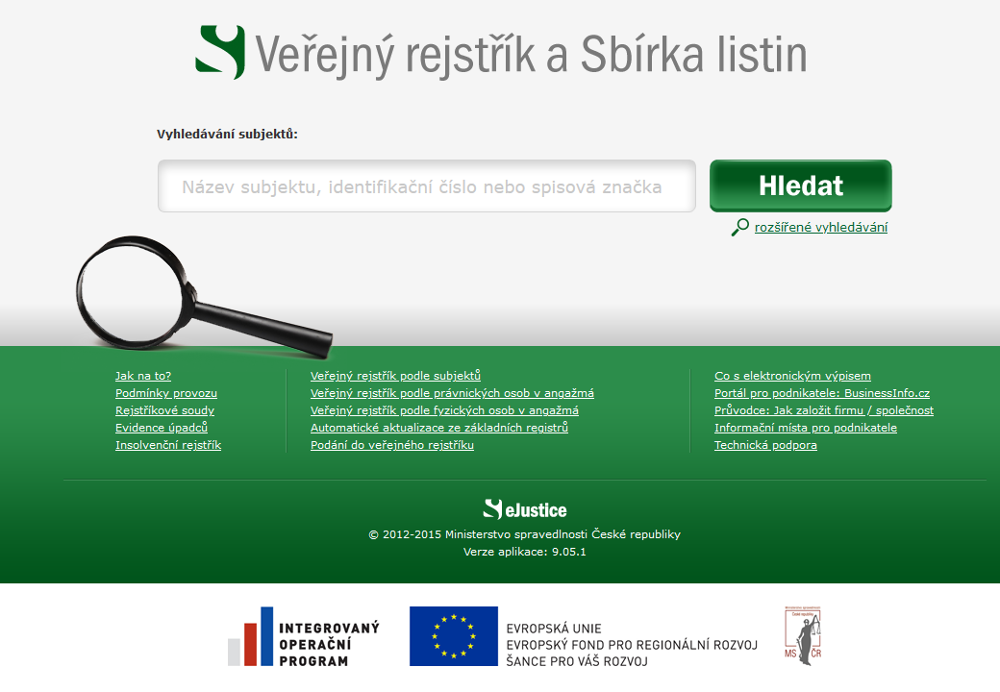
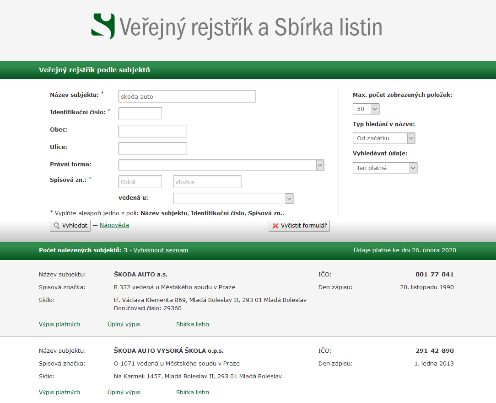
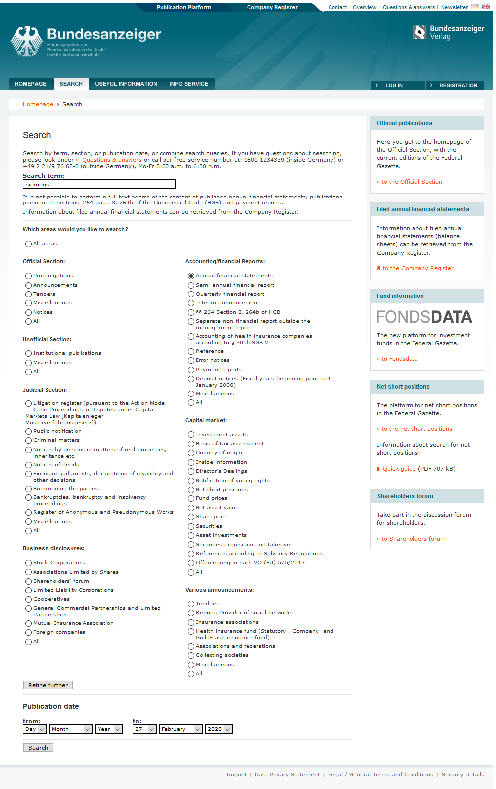
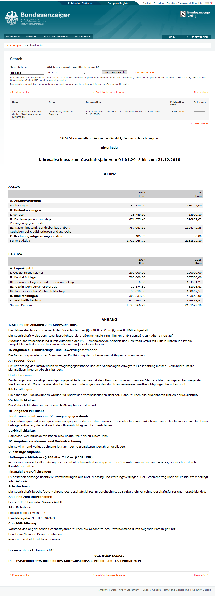

# Česká republika

## https://or.justice.cz
Verejny register a zbierka listin https://or.justice.cz/ , obsahuje výpis z obchodného registru a zbierky listín. Zbierky listín zahrňujú aj účtovné závierky. Príkady: [účtovná závierka ŠKODA AUTO a.s. 2018](https://or.justice.cz/ias/ui/vypis-sl-detail?dokument=58786641&subjektId=47718&spis=73153) alebo [účtovná závierka JetBrains s.r.o. 2018](https://or.justice.cz/ias/ui/vypis-sl-detail?dokument=59949353&subjektId=540142&spis=171172)

### Vyhľdávanie

Ukážka [úplného výpisu z obchodného registru](https://or.justice.cz/ias/ui/rejstrik-firma.vysledky?subjektId=47718&typ=UPLNY)  
Ukážka [zbierky listín](https://or.justice.cz/ias/ui/vypis-sl-firma?subjektId=47718)

# Nemecko

## https://bundesanzeiger.de

Stránka je dostupná aj v angličtine. Vyhľadávanie vcelku dobre urobené, dá sa hľadať podľa rôznych kritérií. Jeden z filterov je `Annual financial statement` (účtovné závierky).

# Veľké firmy bez ohľadu na krajinu

Veľa firiem má ročné správy dostupné na svojich webových stránkach:

https://www.bmwgroup.com/en/investor-relations/financial-reports.html